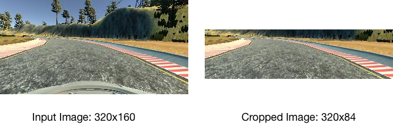
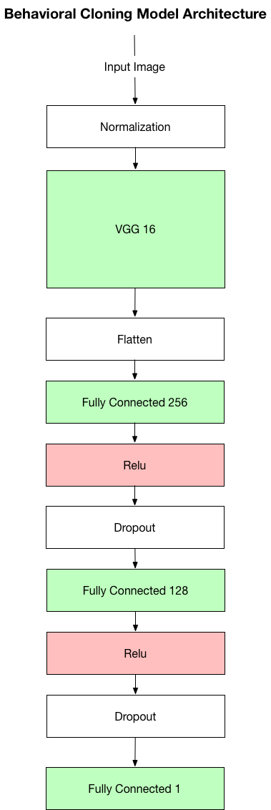

# Behavioral Cloning Project

## Rubric Points

Here I will consider the [rubric points](https://review.udacity.com/#!/rubrics/432/view) individually and describe how I addressed each point in my implementation.

My project includes the following files:

* [Training.ipynb](Training.ipynb) Jupyter notebook that contains the Python code to create and train the model
* `vgg_256_128.h5` trained convolutional neural network to drive the car
* [writeup_report.md](writeup_report.md) (this file) writeup report containing the writeup report that summarizes the results.
* `drive.py` Python script for driving the car in autonomous mode. To this file, I added code to pre-crop incoming images from the simulator
* `video.py` Python script for recording video
* [output_video.mp4](output_video.mp4) output video file showing a successful run of my network around the test track.


#### 2. Submission includes functional code
Using the Udacity provided simulator and my drive.py file, the car can be driven autonomously around the track by executing

```
python3 drive.py vgg_256_128.h5
```

I found out that loading saved models in Keras is sensitive to the versions of Python, Tensorflow and Keras installed on the system. The system configuration I used for training and autonomous driving is as follows:

* Python 3.6.2
* Tensorflow 1.4.0
* Keras 2.0.9

#### 3. Submission code is usable and readable

The `Training.ipynb` contains the code for training and saving the convolution neural network. The file shows the pipeline I used for training and validating the model, and it contains comments to explain how the code works.

### Model Architecture and Training Strategy

#### 1. Model Architecture

My model consists of a [VGG16 convolutional model](http://www.robots.ox.ac.uk/~vgg/research/very_deep/) with two additional fully connected layers (256 and 128). I chose VGG16 with the top layer chopped off for image feature extraction as it is a proven architecture for image processing tasks. The fully connected layers I added are then able to learn the correct driving behavior based on the features extracted by VGG.

Images are cropped in preprocessing to remove the hood and scenery details above the horizon. I removed 50 pixels from the top of the image and 24 pixels from the bottom. The results of the cropping look as follows:



The model includes a lambda layer at the beginning to normalize input images using a simple scaling:

```
# perform normalization at beginning of base VGG16 model
        inp = Input(shape=(84, 320, 3))
        norm = Lambda(lambda x: (x / 255.0) - 0.5 )(inp)
```

The fully-connected layers include RELU activations to introduce nonlinearity. I added a dropout layer (p_drop = 0.1) after each fully-connected layer to mitigate overfitting.


The model outputs a single steering angle value and is trained using MSE as error metric using an Adam optimizer (lr = 0.001).

Here is an image of the architecture:




#### 2. Attempts to reduce overfitting in the model

The model contains dropout layers to reduce overfitting. Furthermore, the model was validated on different datasets to reduce overfitting.

To augment the data, I added the additional camera perspectives (left + right), with a 0.2 steering correction factor.

#### 3. Model Parameter Tuning

The model used an Adam optmizer, so the learning rate did not need to be significantly tuned. The Adam learning rate was set to 0.001.

I tuned the dropout probability to be 0.1 and set batch size to 128 with 64 training epochs.

The fully connected layers were at first set to 128 and 64, but it turned out that this did not provide satisfactory results. Seeing that VGG16 provides a 10240 dimensional flattened output, I decided to double the size of the fully connected layers to handle this amount of input. The final size of the fully connected layers is therefore 256 and 128.

#### 4. Appropriate training data

Training data was chosen to keep the vehicle driving on the road. I mainly tried to keep the vehicle centered on the road. As the mouse-based interface was quite difficult for me to used, several "excursions" from the centerline and recoveries are present in the data.

The following data sets were used to train the final model:

* Training data 1: 2 laps of the track in normal direction
* Training data 2: 2 laps of the track in reverse direction

I tried adding "recovery" data, but this turned out not to be as beneficial as expected. The model works just fine with the normal runs around the track.

### Model Architecture and Training Strategy

#### 1. Solution Design Approach

I basically followed the "don't be a hero" approach and used an existing and proven model architecture, VGG16. I chose this model because of its high performance on the ImageNet dataset and the availability of pre-trained weights, which would save me time during training, as I could "freeze" the weights of the layers belonging to VGG16.

VGG16 will, however only extract useful features from images, and not learn how to drive the car. Therefore, I added an additional two fully-connected layers to learn the driving task from the features provided by VGG.

In order to gage how well the model was working, I split the training data into a training and validation set. Surprisingly, I did not find any significant overfitting problems with this architecture: MSE accuracy was 0.0024 on the training set and 0.005 on the validation set which I thought was adequate.

I did, however conduct steps to mitigate overfitting when implementing the model:

* Dropout layers after each fully-connected layer
* Training with additional camera angles
* Training data gathered while driving the track in reverse direction
* Randomly shuffling datasets

#### 2. Final Model Architecture

I ran the model in the simulator with the fully connected layers set to 128 and 64, which led to the vehicle leaving the track in sections where one lane margin was missing (e.g., shortly after the bridge).

I decided that the fully-connected layers must learn more information about the environment from the VGG16 image features so I doubled the fully connected layers to 256 and 64. The model then drove the car flawlessly around the track, as can be seen [in the video](output_video.mp4).
